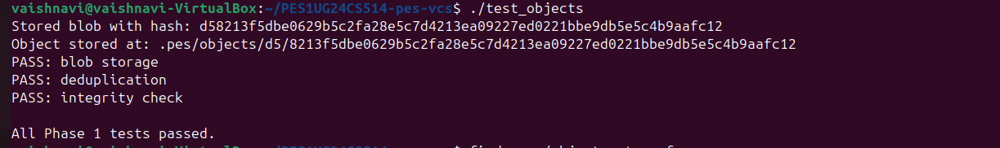
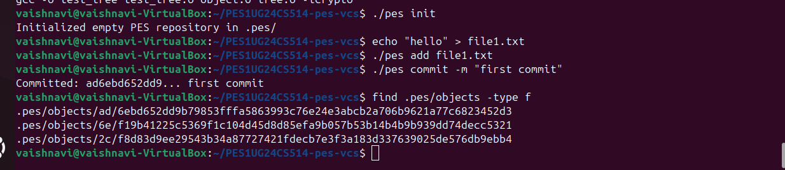
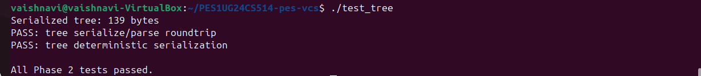
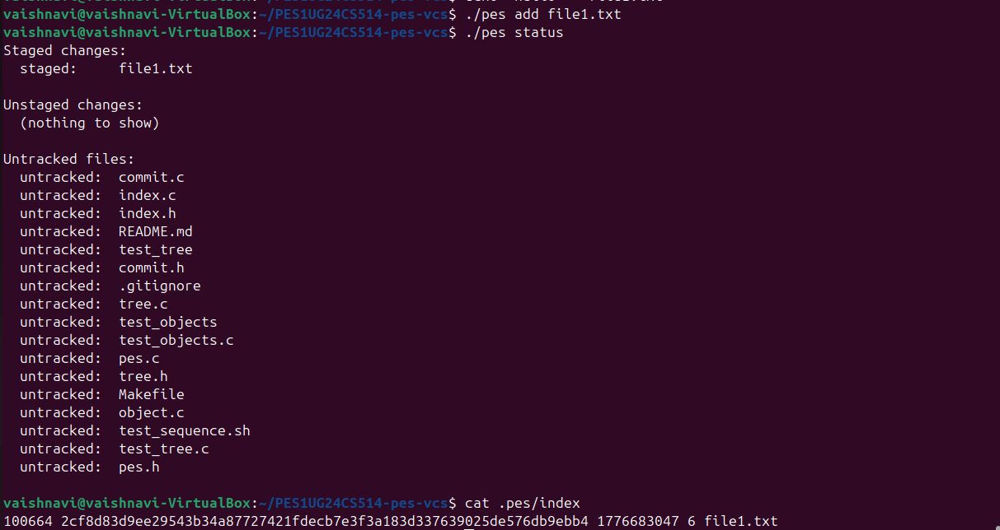

# Building PES-VCS — A Version Control System from Scratch

**Objective:** Build a local version control system that tracks file changes, stores snapshots efficiently, and supports commit history. Every component maps directly to operating system and filesystem concepts.

**Platform:** Ubuntu 22.04

---

## Getting Started

### Prerequisites

```bash
sudo apt update && sudo apt install -y gcc build-essential libssl-dev
```

### Using This Repository

This is a **template repository**. Do **not** fork it.

1. Click **"Use this template"** → **"Create a new repository"** on GitHub
2. Name your repository (e.g., `SRN-pes-vcs`) and set it to **public**. Replace `SRN` with your actual SRN, e.g., `PESXUG24CSYYY-pes-vcs`
3. Clone this repository to your local machine and do all your lab work inside this directory.
4.  **Important:** Remember to commit frequently as you progress. You are required to have a minimum of 5 detailed commits per phase. Refer to [Submission Requirements](#submission-requirements) for more details.
5. Clone your new repository and start working

The repository contains skeleton source files with `// TODO` markers where you need to write code. Functions marked `// PROVIDED` are complete — do not modify them.

### Building

```bash
make          # Build the pes binary
make all      # Build pes + test binaries
make clean    # Remove all build artifacts
```

### Author Configuration

PES-VCS reads the author name from the `PES_AUTHOR` environment variable:

```bash
export PES_AUTHOR="Your Name <PESXUG24CS042>"
```

If unset, it defaults to `"PES User <pes@localhost>"`.

### File Inventory

| File               | Role                                 | Your Task                                          |
| ------------------ | ------------------------------------ | -------------------------------------------------- |
| `pes.h`            | Core data structures and constants   | Do not modify                                      |
| `object.c`         | Content-addressable object store     | Implement `object_write`, `object_read`            |
| `tree.h`           | Tree object interface                | Do not modify                                      |
| `tree.c`           | Tree serialization and construction  | Implement `tree_from_index`                        |
| `index.h`          | Staging area interface               | Do not modify                                      |
| `index.c`          | Staging area (text-based index file) | Implement `index_load`, `index_save`, `index_add`  |
| `commit.h`         | Commit object interface              | Do not modify                                      |
| `commit.c`         | Commit creation and history          | Implement `commit_create`                          |
| `pes.c`            | CLI entry point and command dispatch | Do not modify                                      |
| `test_objects.c`   | Phase 1 test program                 | Do not modify                                      |
| `test_tree.c`      | Phase 2 test program                 | Do not modify                                      |
| `test_sequence.sh` | End-to-end integration test          | Do not modify                                      |
| `Makefile`         | Build system                         | Do not modify                                      |

---

## Understanding Git: What You're Building

Before writing code, understand how Git works under the hood. Git is a content-addressable filesystem with a few clever data structures on top. Everything in this lab is based on Git's real design.

### The Big Picture

When you run `git commit`, Git doesn't store "changes" or "diffs." It stores **complete snapshots** of your entire project. Git uses two tricks to make this efficient:

1. **Content-addressable storage:** Every file is stored by the SHA hash of its contents. Same content = same hash = stored only once.
2. **Tree structures:** Directories are stored as "tree" objects that point to file contents, so unchanged files are just pointers to existing data.

```
Your project at commit A:          Your project at commit B:
                                   (only README changed)

    root/                              root/
    ├── README.md  ─────┐              ├── README.md  ─────┐
    ├── src/            │              ├── src/            │
    │   └── main.c ─────┼─┐            │   └── main.c ─────┼─┐
    └── Makefile ───────┼─┼─┐          └── Makefile ───────┼─┼─┐
                        │ │ │                              │ │ │
                        ▼ ▼ ▼                              ▼ ▼ ▼
    Object Store:       ┌─────────────────────────────────────────────┐
                        │  a1b2c3 (README v1)    ← only this is new   │
                        │  d4e5f6 (README v2)                         │
                        │  789abc (main.c)       ← shared by both!    │
                        │  fedcba (Makefile)     ← shared by both!    │
                        └─────────────────────────────────────────────┘
```

### The Three Object Types

#### 1. Blob (Binary Large Object)

A blob is just file contents. No filename, no permissions — just the raw bytes.

```
blob 16\0Hello, World!\n
     ↑    ↑
     │    └── The actual file content
     └─────── Size in bytes
```

The blob is stored at a path determined by its SHA-256 hash. If two files have identical contents, they share one blob.

#### 2. Tree

A tree represents a directory. It's a list of entries, each pointing to a blob (file) or another tree (subdirectory).

```
100644 blob a1b2c3d4... README.md
100755 blob e5f6a7b8... build.sh        ← executable file
040000 tree 9c0d1e2f... src             ← subdirectory
       ↑    ↑           ↑
       │    │           └── name
       │    └── hash of the object
       └─────── mode (permissions + type)
```

Mode values:
- `100644` — regular file, not executable
- `100755` — regular file, executable
- `040000` — directory (tree)

#### 3. Commit

A commit ties everything together. It points to a tree (the project snapshot) and contains metadata.

```
tree 9c0d1e2f3a4b5c6d7e8f9a0b1c2d3e4f5a6b7c8d
parent a1b2c3d4e5f6a7b8c9d0e1f2a3b4c5d6e7f8a9b0
author Alice <alice@example.com> 1699900000
committer Alice <alice@example.com> 1699900000

Add new feature
```

The parent pointer creates a linked list of history:

```
    C3 ──────► C2 ──────► C1 ──────► (no parent)
    │          │          │
    ▼          ▼          ▼
  Tree3      Tree2      Tree1
```

### How Objects Connect

```
                    ┌─────────────────────────────────┐
                    │           COMMIT                │
                    │  tree: 7a3f...                  │
                    │  parent: 4b2e...                │
                    │  author: Alice                  │
                    │  message: "Add feature"         │
                    └─────────────┬───────────────────┘
                                  │
                                  ▼
                    ┌─────────────────────────────────┐
                    │         TREE (root)             │
                    │  100644 blob f1a2... README.md  │
                    │  040000 tree 8b3c... src        │
                    │  100644 blob 9d4e... Makefile   │
                    └──────┬──────────┬───────────────┘
                           │          │
              ┌────────────┘          └────────────┐
              ▼                                    ▼
┌─────────────────────────┐          ┌─────────────────────────┐
│      TREE (src)         │          │     BLOB (README.md)    │
│ 100644 blob a5f6 main.c │          │  # My Project           │
└───────────┬─────────────┘          └─────────────────────────┘
            ▼
       ┌────────┐
       │ BLOB   │
       │main.c  │
       └────────┘
```

### References and HEAD

References are files that map human-readable names to commit hashes:

```
.pes/
├── HEAD                    # "ref: refs/heads/main"
└── refs/
    └── heads/
        └── main            # Contains: a1b2c3d4e5f6...
```

**HEAD** points to a branch name. The branch file contains the latest commit hash. When you commit:

1. Git creates the new commit object (pointing to parent)
2. Updates the branch file to contain the new commit's hash
3. HEAD still points to the branch, so it "follows" automatically

```
Before commit:                    After commit:

HEAD ─► main ─► C2 ─► C1         HEAD ─► main ─► C3 ─► C2 ─► C1
```

### The Index (Staging Area)

The index is the "preparation area" for the next commit. It tracks which files are staged.
# PES Version Control System (PES-VCS)

## 📌 Overview

This project implements a simplified version control system inspired by Git. It supports storing files as objects, staging changes, building directory trees, and creating commits.

---

## 🚀 Features

* Content-addressable storage using SHA-256
* Blob objects for file contents
* Tree objects for directory structure
* Index (staging area) for tracking files
* Commit objects for project snapshots
* Deduplication (same content stored only once)

---

## 🧠 System Workflow

### 1. `pes init`

Initializes repository by creating `.pes/` directory.

### 2. `pes add <file>`

* Reads file content
* Stores it as a blob object
* Updates `.pes/index`

### 3. `pes status`

* Shows staged files
* Shows modified/deleted files
* Shows untracked files

### 4. `pes commit -m "message"`

* Converts index → tree
* Creates commit object
* Stores snapshot of project

---

## 🛠️ Build Instructions

```bash
make clean
make all
```

---

## ▶️ Usage

```bash
./pes init
echo "hello" > file1.txt
./pes add file1.txt
./pes status
./pes commit -m "first commit"
```

---

## 📂 Project Structure

```
.pes/
 ├── objects/   # blob, tree, commit objects
 └── index      # staging area
```

---

## 📸 Screenshots

### Phase 1



### Phase 2



### Phase 3



### Phase 4



---

## 🎯 Learning Outcomes

* Understanding Git internals
* Hash-based storage systems
* File system operations (fsync, rename)
* Version control concepts

---

## 👩‍💻 Author

Vaishnavi
PES University
